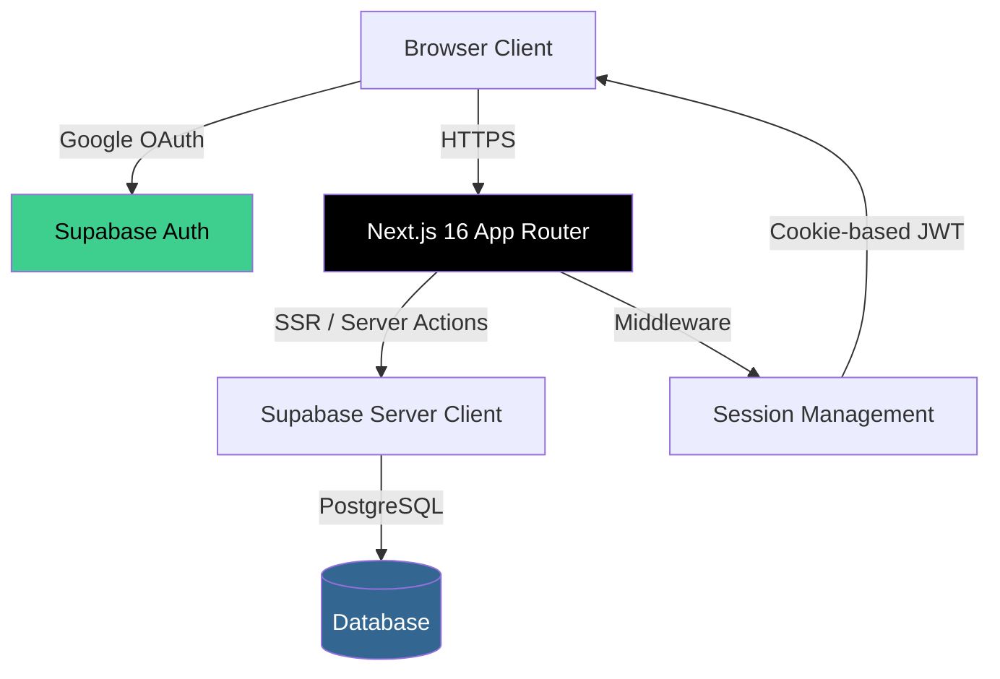
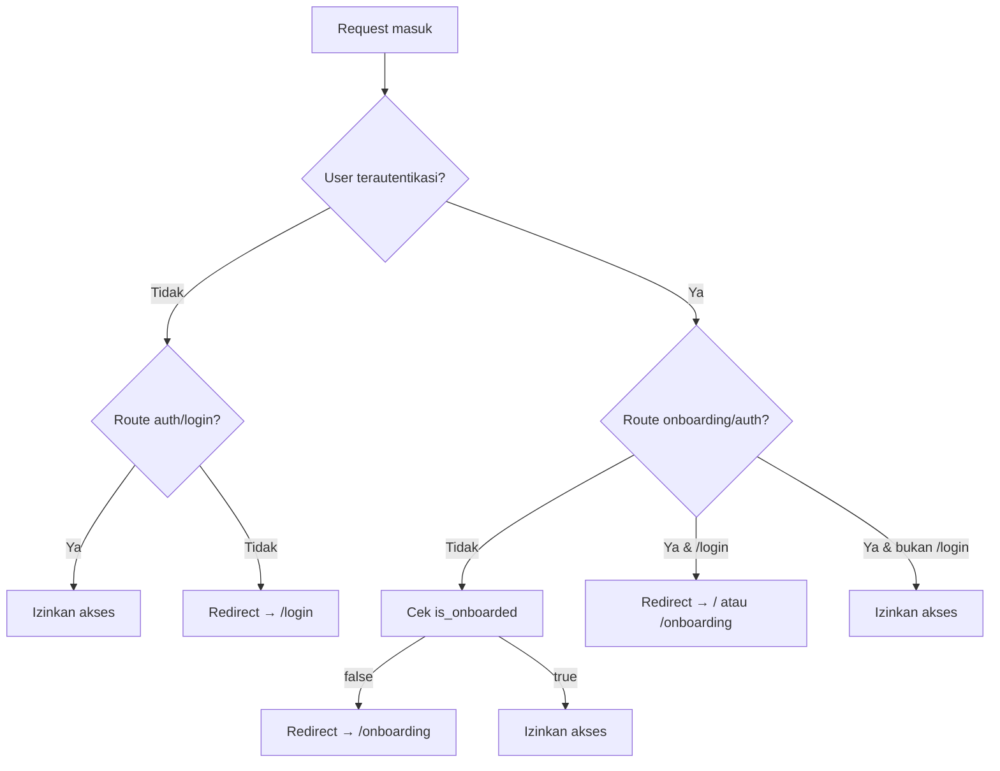
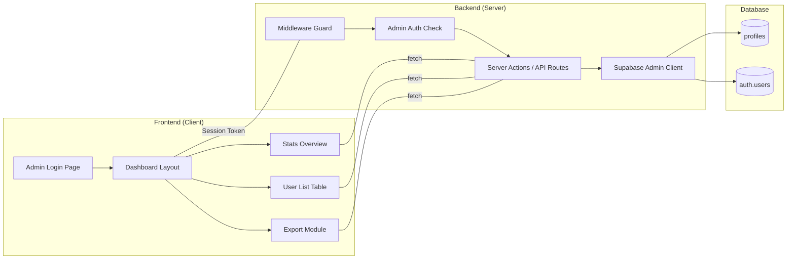
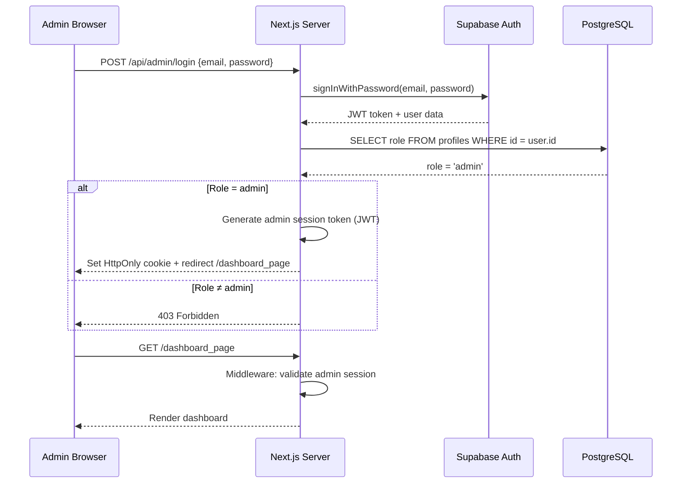
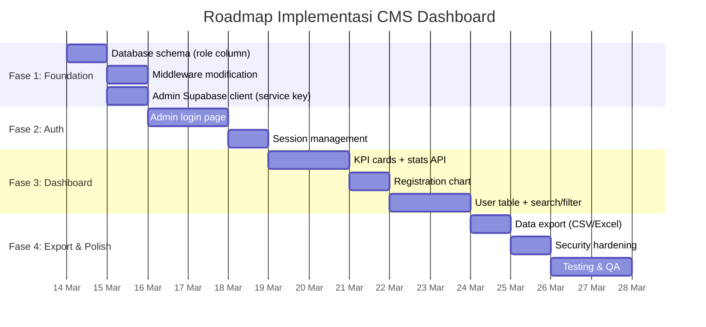

# Laporan Evaluasi Teknis: Modul CMS Dashboard — Smart Nenkin

> **Tanggal**: 13 Maret 2026  
> **Proyek**: Smart Nenkin (Kalkulator Nenkin — EXATA Indonesia)  
> **Versi Aplikasi**: Next.js 16.1.6 + Supabase SSR + TailwindCSS v4  
> **Scope**: Evaluasi kelayakan penambahan modul CMS Dashboard Admin

---

## Daftar Isi

1. [Ringkasan Eksekutif](#1-ringkasan-eksekutif)
2. [Audit Kelayakan Arsitektur](#2-audit-kelayakan-arsitektur)
3. [Rekomendasi Desain Struktur Dashboard](#3-rekomendasi-desain-struktur-dashboard)
4. [Analisis & Saran UI/UX](#4-analisis--saran-uiux)
5. [Rekomendasi Data, Metrik & Informasi Dashboard](#5-rekomendasi-data-metrik--informasi-dashboard)
6. [Desain Login Admin & Keamanan](#6-desain-login-admin--keamanan)
7. [Matriks Risiko & Mitigasi](#7-matriks-risiko--mitigasi)
8. [Kesimpulan & Saran Prioritas Implementasi](#8-kesimpulan--saran-prioritas-implementasi)

---

## 1. Ringkasan Eksekutif

Aplikasi **Smart Nenkin** saat ini merupakan kalkulator pensiun Jepang berbasis web yang dibangun dengan **Next.js 16 (App Router)**, **Supabase** sebagai backend (Authentication + PostgreSQL), dan **TailwindCSS v4** untuk styling. Autentikasi pengguna menggunakan **Google OAuth** melalui Supabase Auth, dan data profil pengguna disimpan di tabel `profiles` dengan **Row Level Security (RLS)** yang membatasi akses hanya ke data milik sendiri.

### Kesimpulan Utama

| Aspek | Status | Catatan |
|-------|--------|---------|
| Kelayakan Arsitektur | ✅ Layak | Next.js App Router mendukung route group terpisah untuk dashboard |
| Kesiapan Database | ⚠️ Perlu Modifikasi | RLS saat ini memblokir akses admin ke data semua pengguna |
| Sistem Role | ❌ Belum Ada | Tidak ada mekanisme pembeda admin vs user biasa |
| Keamanan Endpoint | ⚠️ Perlu Desain Matang | Pendekatan "hidden URL" saja tidak cukup aman |
| Supabase Service Key | ⚠️ Belum Dikonfigurasi | Diperlukan `SUPABASE_SERVICE_ROLE_KEY` untuk akses admin |

> [!IMPORTANT]
> Modul CMS Dashboard **layak diimplementasikan** di atas arsitektur yang ada, namun memerlukan penambahan infrastruktur keamanan yang signifikan — terutama **sistem role admin**, **RLS policy baru**, dan **mekanisme autentikasi admin terpisah** dari flow Google OAuth yang ada.

---

## 2. Audit Kelayakan Arsitektur

### 2.1 Stack Teknologi Saat Ini



| Komponen | Teknologi | Versi |
|----------|-----------|-------|
| Framework | Next.js (App Router) | 16.1.6 |
| Runtime | React | 19.2.3 |
| Auth & DB | Supabase (SSR) | 2.97.0 |
| Styling | TailwindCSS + PostCSS | v4 |
| Theme | next-themes | 0.4.6 |
| Language | TypeScript | 5.x |

### 2.2 Struktur Route Saat Ini

```
src/app/
├── page.tsx              → / (Kalkulator Nenkin - halaman utama)
├── layout.tsx            → Root layout (font, SEO, providers)
├── login/page.tsx        → /login (Google OAuth)
├── onboarding/           → /onboarding (form profil user)
│   ├── page.tsx
│   └── actions.ts        → Server Action untuk submit profil
├── auth/callback/        → /auth/callback (OAuth redirect handler)
└── api/exchange-rate/    → /api/exchange-rate (API kurs JPY→IDR)
```

### 2.3 Skema Database

```sql
-- Tabel satu-satunya: profiles
CREATE TABLE public.profiles (
  id UUID PRIMARY KEY REFERENCES auth.users(id) ON DELETE CASCADE,
  fullname TEXT,
  return_date TEXT,        -- Format: YYYY-MM (bulan kepulangan)
  whatsapp TEXT,           -- Format: +62xxx atau +81xxx
  lpk TEXT,                -- Nullable, nama LPK/SO
  is_onboarded BOOLEAN DEFAULT false,
  created_at TIMESTAMP WITH TIME ZONE DEFAULT now()
);
```

> [!NOTE]
> Email pengguna **tidak tersimpan** di tabel `profiles`, melainkan ada di tabel `auth.users` milik Supabase. Dashboard admin harus melakukan **JOIN** atau query terpisah ke `auth.users` untuk mendapatkan email.

### 2.4 Kebijakan RLS Saat Ini

```sql
-- Setiap user hanya bisa SELECT / UPDATE / INSERT data miliknya sendiri
USING ( auth.uid() = id )
```

> [!CAUTION]
> **Isu Kritis**: RLS policy saat ini **secara eksplisit memblokir** siapa pun untuk membaca data profil pengguna lain. Artinya, dashboard admin yang menggunakan Supabase client biasa (anon key) **tidak akan bisa** menampilkan daftar semua pengguna. Diperlukan salah satu pendekatan berikut:
> 1. **Supabase Service Role Key** (server-side only) — bypass RLS sepenuhnya
> 2. **RLS policy baru** untuk role admin — lebih granular tapi lebih kompleks
> 3. **Database function (RPC)** dengan `SECURITY DEFINER` — pendekatan hybrid

### 2.5 Middleware & Session Flow



**Implikasi untuk Dashboard**:
- Middleware saat ini akan **memaksa admin login via Google OAuth** dan mengecek `is_onboarded` sebelum bisa mengakses `/dashboard_page`
- Ini **bertentangan** dengan kebutuhan untuk memiliki login admin yang terpisah
- Middleware **harus dimodifikasi** untuk mengecualikan route `/dashboard_page` dari flow normal, atau handle admin auth secara terpisah

### 2.6 Kesimpulan Audit Kelayakan

| Aspek | Kompatibilitas | Aksi Diperlukan |
|-------|----------------|-----------------|
| Next.js App Router | ✅ Tinggi | Gunakan route group `(admin)` untuk isolasi |
| Supabase Auth | ✅ Tinggi | Tambah akun admin via Supabase Auth (email/password) |
| Database Schema | ⚠️ Modifikasi minor | Tambah kolom `role` di `profiles` atau tabel `admin_users` terpisah |
| RLS Policies | ⚠️ Modifikasi kritis | Tambah policy admin atau gunakan Service Role Key |
| Middleware | ⚠️ Modifikasi kritis | Exclude `/dashboard_page` dari onboarding flow |
| Environment Variables | ⚠️ Tambahan baru | Tambah `SUPABASE_SERVICE_ROLE_KEY` (server-side only) |
| Styling/Design System | ✅ Tinggi | Reuse design tokens yang sudah ada di `tailwind.config.ts` |

---

## 3. Rekomendasi Desain Struktur Dashboard

### 3.1 Arsitektur Route yang Diusulkan

```
src/app/
├── (public)/              → Route group untuk halaman publik (existing)
│   ├── page.tsx
│   ├── login/
│   └── onboarding/
│
├── dashboard_page/        → Route admin (path tersembunyi)
│   ├── layout.tsx         → Admin layout (sidebar, auth check)
│   ├── page.tsx           → Dashboard utama (statistik & overview)
│   ├── login/
│   │   └── page.tsx       → Halaman login admin (terpisah dari user login)
│   └── users/
│       └── page.tsx       → Daftar & manajemen pengguna
│
├── api/
│   ├── exchange-rate/     → (existing)
│   └── admin/             → API routes untuk dashboard
│       ├── stats/route.ts → Endpoint statistik
│       └── export/route.ts → Endpoint ekspor data
```

### 3.2 Komponen Arsitektur



### 3.3 Struktur File & Komponen yang Direkomendasikan

```
src/
├── app/dashboard_page/
│   ├── layout.tsx              → Layout admin: sidebar + auth guard
│   ├── page.tsx                → Halaman utama: KPI cards + chart
│   ├── login/page.tsx          → Form login admin (email/password)
│   └── users/page.tsx          → Tabel data pengguna + filter + export
│
├── components/admin/
│   ├── AdminSidebar.tsx        → Navigation sidebar
│   ├── StatsCard.tsx           → Card metrik individual
│   ├── RegistrationChart.tsx   → Chart registrasi per bulan
│   ├── UserTable.tsx           → Tabel pengguna dengan search/filter
│   └── ExportButton.tsx        → Tombol ekspor CSV/Excel
│
├── lib/server/
│   ├── adminAuth.ts            → Utilitas autentikasi admin
│   └── adminSupabase.ts        → Supabase client dengan Service Role Key
│
└── types/
    └── admin.ts                → Tipe data untuk modul admin
```

---

## 4. Analisis & Saran UI/UX

### 4.1 Prinsip Desain Dashboard Admin

| Prinsip | Implementasi |
|---------|-------------|
| **Clarity** | Informasi paling penting (total user, registrasi bulan ini) harus terlihat dalam 3 detik pertama |
| **Efficiency** | Aksi utama (export, search) harus bisa diakses tanpa scroll |
| **Consistency** | Gunakan design tokens yang sama dari `tailwind.config.ts` (warna primary `#FF4D00`, font Inter) |
| **Density** | Dashboard admin boleh lebih "padat" informasinya dibanding halaman publik |

### 4.2 Layout Dashboard yang Direkomendasikan

```
┌──────────────────────────────────────────────────────────────┐
│  SIDEBAR (240px)  │  HEADER BAR (admin name, logout)        │
│                   │─────────────────────────────────────────│
│  📊 Dashboard     │  KPI ROW                                │
│  👥 Pengguna      │  ┌─────────┐ ┌─────────┐ ┌─────────┐   │
│  📤 Ekspor        │  │ Total   │ │ Bulan   │ │ Belum   │   │
│                   │  │ Users   │ │ Ini     │ │ Onboard │   │
│                   │  └─────────┘ └─────────┘ └─────────┘   │
│                   │                                         │
│                   │  CHART: Registrasi per Bulan             │
│                   │  ┌─────────────────────────────────────┐ │
│                   │  │  ███                                │ │
│                   │  │  ███ ███                            │ │
│                   │  │  ███ ███ ███ ███ ███ ███            │ │
│                   │  └─────────────────────────────────────┘ │
│                   │                                         │
│                   │  TABEL: Daftar Pengguna Terbaru          │
│                   │  ┌─────────────────────────────────────┐ │
│                   │  │ Search... │ Filter ▼ │ Export ▼    │ │
│                   │  │─────────────────────────────────────│ │
│                   │  │ Nama | Email | Return | WA | LPK   │ │
│                   │  │ ...  | ...   | ...    | .. | ...   │ │
│                   │  └─────────────────────────────────────┘ │
└──────────────────────────────────────────────────────────────┘
```

### 4.3 Rekomendasi UX Spesifik

#### a. Halaman Login Admin
- **Desain minimalis** dan berbeda dari halaman login user (yang menggunakan Google OAuth)
- Form sederhana: email + password + tombol login
- **Tidak ada link "Daftar"** — akun admin hanya bisa dibuat oleh admin lain atau melalui Supabase Dashboard
- Tampilkan branding "EXATA — Admin Panel" agar jelas ini area admin
- Gunakan **rate limiting** visual (cooldown setelah 3x gagal login)

#### b. Dashboard Overview
- **KPI Cards** di bagian atas — auto-refresh setiap 60 detik
- **Bar chart** registrasi per bulan — default tampilkan 6 bulan terakhir, bisa dikustomisasi
- **Tabel 10 pengguna terbaru** di bawah chart
- **Responsive**: Di mobile, sidebar menjadi hamburger menu

#### c. Halaman Daftar Pengguna (`/dashboard_page/users`)
- Tabel dengan fitur:
  - 🔍 **Search** by nama, email, atau nomor WA
  - 🏷️ **Filter** by bulan return_date, status onboarding, LPK
  - 📊 **Sort** by tanggal registrasi, nama, bulan kepulangan
  - 📄 **Pagination** (25/50/100 per halaman)
  - 📤 **Export** (CSV / Excel) — semua data atau data terfilter

#### d. Aksesibilitas & Micro-interactions
- Hover effects pada rows tabel untuk menandai area klik
- Loading skeleton saat data di-fetch
- Toast notification saat ekspor berhasil
- Konfirmasi sebelum ekspor data besar

### 4.4 Perbandingan Pendekatan UI Framework

| Opsi | Pro | Kontra | Rekomendasi |
|------|-----|--------|-------------|
| Pure TailwindCSS (tanpa library tambahan) | Ringan, konsisten, tidak ada dependensi baru | Butuh effort lebih untuk tabel & chart | ✅ **Direkomendasikan** |
| Shadcn/ui | Komponen siap pakai, accessible | Menambah ukuran bundle | ⚡ Alternatif solid |
| Recharts (untuk chart saja) | Ringan, React-native | Satu dependensi tambahan | ✅ Bisa ditambahkan |

---

## 5. Rekomendasi Data, Metrik & Informasi Dashboard

### 5.1 KPI Cards (Metrik Utama)

| Metrik | Sumber Data | Prioritas |
|--------|-------------|-----------|
| **Total Pengguna Terdaftar** | `COUNT(*)` dari `profiles` | 🔴 Kritis |
| **Registrasi Bulan Ini** | `COUNT(*)` WHERE `created_at` bulan ini | 🔴 Kritis |
| **Belum Onboarding** | `COUNT(*)` WHERE `is_onboarded = false` | 🟡 Penting |
| **Pengguna dengan LPK** | `COUNT(*)` WHERE `lpk IS NOT NULL AND lpk != ''` | 🟢 Informatif |
| **Return Date Terdekat** | `MIN(return_date)` WHERE `return_date >= NOW()` | 🟡 Penting |

### 5.2 Visualisasi Chart

| Chart | Tipe | Data |
|-------|------|------|
| **Registrasi per Bulan** | Bar Chart | Group by `MONTH(created_at)`, 12 bulan terakhir |
| **Distribusi Return Date** | Horizontal Bar | Group by `return_date` (bulan), 12 bulan ke depan |
| **Top 10 LPK** | Pie / Donut Chart | Group by `lpk`, top 10 |
| **Tren Onboarding** | Line Chart | Perbandingan total registrasi vs completed onboarding |

### 5.3 Tabel Data Pengguna

Kolom yang harus ditampilkan:

| Kolom | Sumber | Format | Sortable | Filterable |
|-------|--------|--------|----------|------------|
| **#** | Auto-increment | Number | — | — |
| **Nama Lengkap** | `profiles.fullname` | Text | ✅ | ✅ (search) |
| **Email** | `auth.users.email` | Text | ✅ | ✅ (search) |
| **Return Date** | `profiles.return_date` | `MMM YYYY` (e.g. "Agu 2026") | ✅ | ✅ (range) |
| **No. WhatsApp** | `profiles.whatsapp` | `+62xxx` (clickable link) | — | ✅ (search) |
| **LPK/SO** | `profiles.lpk` | Text atau "–" jika null | ✅ | ✅ (dropdown) |
| **Status** | `profiles.is_onboarded` | Badge: ✅ Aktif / ⏳ Pending | — | ✅ (toggle) |
| **Tgl Registrasi** | `profiles.created_at` | `DD/MM/YYYY HH:mm` | ✅ | ✅ (date range) |

### 5.4 Format Ekspor Data

| Format | Library | Use Case |
|--------|---------|----------|
| **CSV** | Native (no library) | Universal, mudah dibuka di Excel/Google Sheets |
| **XLSX** | `xlsx` atau `exceljs` | Format native Excel, mendukung styling |

**Kolom yang diekspor**: Semua kolom tabel + kolom tambahan yang mungkin tidak ditampilkan di UI (misalnya UUID user untuk referensi teknis).

**Header ekspor yang direkomendasikan**:
```
No | Nama Lengkap | Email | Estimasi Kepulangan | No. WhatsApp | LPK/SO | Status Onboarding | Tanggal Registrasi
```

### 5.5 Query Contoh untuk Dashboard Stats

```sql
-- KPI: Total users
SELECT COUNT(*) as total_users FROM profiles;

-- KPI: Registrasi bulan ini
SELECT COUNT(*) as this_month
FROM profiles
WHERE DATE_TRUNC('month', created_at) = DATE_TRUNC('month', NOW());

-- Chart: Registrasi per bulan (12 bulan terakhir)
SELECT
  TO_CHAR(created_at, 'YYYY-MM') as month,
  COUNT(*) as count
FROM profiles
WHERE created_at >= NOW() - INTERVAL '12 months'
GROUP BY TO_CHAR(created_at, 'YYYY-MM')
ORDER BY month;

-- Tabel: Semua user dengan email (PERLU Service Role / RLS bypass)
SELECT
  p.fullname,
  u.email,
  p.return_date,
  p.whatsapp,
  p.lpk,
  p.is_onboarded,
  p.created_at
FROM profiles p
JOIN auth.users u ON p.id = u.id
ORDER BY p.created_at DESC;
```

> [!WARNING]
> Query terakhir di atas melakukan `JOIN` ke `auth.users` yang merupakan tabel internal Supabase. Akses ke tabel ini **hanya bisa dilakukan** melalui:
> 1. Supabase Admin API (Service Role Key)
> 2. Database function (RPC) dengan `SECURITY DEFINER`
> 3. Supabase Management API (`/auth/v1/admin/users`)
>
> **Rekomendasi**: Gunakan Supabase Admin API (opsi 1) untuk kesederhanaan dan keamanan.

---

## 6. Desain Login Admin & Keamanan

### 6.1 Arsitektur Autentikasi Admin



### 6.2 Strategi Autentikasi yang Direkomendasikan

#### Opsi A: Supabase Email/Password + Role Check ✅ **DIREKOMENDASIKAN**

| Aspek | Detail |
|-------|--------|
| **Mekanisme login** | `supabase.auth.signInWithPassword({ email, password })` |
| **Verifikasi role** | Setelah login berhasil, cek kolom `role` di `profiles` |
| **Token** | Gunakan JWT dari Supabase (sudah HS256 by default) |
| **Session** | Cookie HttpOnly, Secure, SameSite=Strict |
| **Pro** | Terintegrasi penuh, tanpa infrastruktur tambahan |
| **Kontra** | Akun admin harus terdaftar di `auth.users` bersama user biasa |

#### Opsi B: Custom JWT Terpisah (ECC P-256)

| Aspek | Detail |
|-------|--------|
| **Mekanisme login** | Custom API endpoint, verifikasi credential manual |
| **Token** | Custom JWT signed dengan ES256 (ECC P-256) |
| **Pro** | Isolasi penuh dari Supabase Auth, lebih fleksibel |
| **Kontra** | Butuh key management, lebih kompleks, maintenance lebih berat |

> [!TIP]
> **Opsi A sangat direkomendasikan** karena Supabase Auth sudah secara otomatis menerbitkan JWT yang di-sign dengan HS256 menggunakan `JWT Secret` proyek. Menambahkan layer JWT custom (ECC/P-256) akan menambah kompleksitas tanpa benefit keamanan yang signifikan untuk skala aplikasi ini. Jika ke depannya diperlukan rotasi key yang lebih aman, migrasi ke RS256 bisa dilakukan melalui konfigurasi Supabase.

### 6.3 Rekomendasi Perubahan Database

```sql
-- 1. Tambahkan kolom role ke tabel profiles
ALTER TABLE public.profiles
ADD COLUMN role TEXT DEFAULT 'user' CHECK (role IN ('user', 'admin'));

-- 2. Tambahkan RLS policy untuk admin
CREATE POLICY "Admins can view all profiles"
ON public.profiles FOR SELECT
USING (
  auth.uid() IN (
    SELECT id FROM public.profiles WHERE role = 'admin'
  )
);

-- 3. Buat admin user pertama (via Supabase Dashboard)
-- Setelah membuat user email/password di Supabase Auth Dashboard:
UPDATE public.profiles SET role = 'admin' WHERE id = '<admin-uuid>';
```

### 6.4 Modifikasi Middleware

```typescript
// Perubahan yang diperlukan di src/utils/supabase/middleware.ts

const isDashboardRoute = request.nextUrl.pathname.startsWith('/dashboard_page');
const isDashboardLogin = request.nextUrl.pathname === '/dashboard_page/login';

if (isDashboardRoute) {
  if (!user && !isDashboardLogin) {
    // Redirect ke login admin, bukan login user
    return NextResponse.redirect(new URL('/dashboard_page/login', request.url));
  }
  if (user && !isDashboardLogin) {
    // Verifikasi role admin
    const { data: profile } = await supabase
      .from('profiles')
      .select('role')
      .eq('id', user.id)
      .single();
    
    if (profile?.role !== 'admin') {
      return NextResponse.redirect(new URL('/', request.url)); // Bukan admin → kick out
    }
  }
  return supabaseResponse; // Skip onboarding check untuk admin
}

// ... flow normal untuk user biasa (existing logic) ...
```

### 6.5 Manajemen Sesi Admin

| Parameter | Nilai yang Direkomendasikan |
|-----------|---------------------------|
| **Token Lifetime** | 1 jam (3600 detik) |
| **Refresh Token** | Aktif, expire 7 hari |
| **Cookie Flags** | `HttpOnly`, `Secure`, `SameSite=Strict`, `Path=/dashboard_page` |
| **Inactivity Timeout** | 30 menit (client-side auto-logout) |
| **Max Sessions** | 1 per admin (opsional, tergantung kebutuhan) |

### 6.6 Proteksi Endpoint & Hardening

| Vektor Ancaman | Mitigasi |
|----------------|----------|
| **Brute Force Login** | Rate limiting via Supabase (built-in) + tambahan di Next.js middleware (IP-based cooldown) |
| **URL Discovery** | Path `/dashboard_page` tidak terindeks (tambahkan ke `robots.ts` disallow) + tidak ada link dari navigasi publik |
| **Session Hijacking** | HttpOnly cookie + HTTPS only + SameSite=Strict |
| **CSRF** | SameSite cookie + Supabase CSRF protection |
| **Privilege Escalation** | Server-side role check di **setiap** API route admin, bukan hanya di middleware |
| **Data Exposure via API** | Semua API admin routes harus verifikasi role sebelum return data |
| **XSS** | React default escaping + CSP headers (opsional) |

> [!CAUTION]
> **Keamanan hidden URL**: Menggunakan path tersembunyi (`/dashboard_page`) sebagai **satu-satunya** mekanisme keamanan adalah **SANGAT TIDAK AMAN**. Path ini bisa ditemukan melalui:
> - Source code yang ter-deploy (JavaScript bundle berisi referensi route)
> - Browser history sharing
> - Referer header leak
> - Brute force path scanning
>
> Path tersembunyi **boleh digunakan sebagai lapisan tambahan** (defense in depth), tetapi **WAJIB** didukung oleh autentikasi dan otorisasi yang kuat di baliknya.

---

## 7. Matriks Risiko & Mitigasi

| # | Risiko | Severity | Likelihood | Mitigasi |
|---|--------|----------|------------|----------|
| 1 | Admin endpoint ditemukan oleh pihak tidak berwenang | 🟡 Medium | 🔴 Tinggi | Auth + role check wajib, path hanya lapisan tambahan |
| 2 | RLS blocking admin queries | 🔴 Tinggi | 🔴 Pasti | Gunakan Service Role Key (server-only) atau RLS policy baru |
| 3 | Supabase Service Role Key bocor | 🔴 Kritis | 🟢 Rendah | Key HANYA di env server, BUKAN `NEXT_PUBLIC_*` |
| 4 | Brute force login admin | 🟡 Medium | 🟡 Medium | Rate limiting + account lockout setelah 5x gagal |
| 5 | Data ekspor berisi PII | 🟡 Medium | 🔴 Pasti | Log semua aktivitas ekspor + konfirmasi download |
| 6 | Middleware bypass via direct API | 🔴 Tinggi | 🟡 Medium | Role check di setiap API route, bukan hanya middleware |
| 7 | Admin session tidak expire | 🟡 Medium | 🟡 Medium | Token TTL 1 jam + inactivity timeout 30 menit |

---

## 8. Kesimpulan & Saran Prioritas Implementasi

### 8.1 Rangkuman Kelayakan

Modul CMS Dashboard **layak dan feasible** untuk diimplementasikan di atas arsitektur Smart Nenkin yang ada. Next.js App Router menyediakan mekanisme routing yang fleksibel, dan Supabase menyediakan semua building blocks yang diperlukan (Auth, Database, RLS, Admin API).

### 8.2 Tahapan Implementasi yang Disarankan



### 8.3 Prioritas Tinggi (Harus Ada di V1)

1. ✅ Modifikasi database: tambah kolom `role`
2. ✅ Modifikasi middleware: exclude dashboard route dari onboarding flow + admin auth guard
3. ✅ Halaman login admin (email/password via Supabase)
4. ✅ Dashboard overview: KPI cards + chart registrasi
5. ✅ Tabel pengguna dengan search dan pagination
6. ✅ Ekspor data CSV
7. ✅ Security: rate limiting, HttpOnly cookie, role check per-route

### 8.4 Nice-to-Have (V2)

- Export XLSX dengan styling
- Chart distribusi return date & top LPK
- Activity log (siapa ekspor data, kapan)
- Multi-admin management
- Dashboard real-time updates (Supabase Realtime)
- Dark mode untuk dashboard

---

> **Catatan Penutup**: Laporan ini bersifat evaluasi teknis dan konseptual. Semua pseudocode dan contoh query yang disertakan **bukan** implementasi final, melainkan panduan arah arsitektur. Detail implementasi spesifik perlu disesuaikan pada tahap development.
